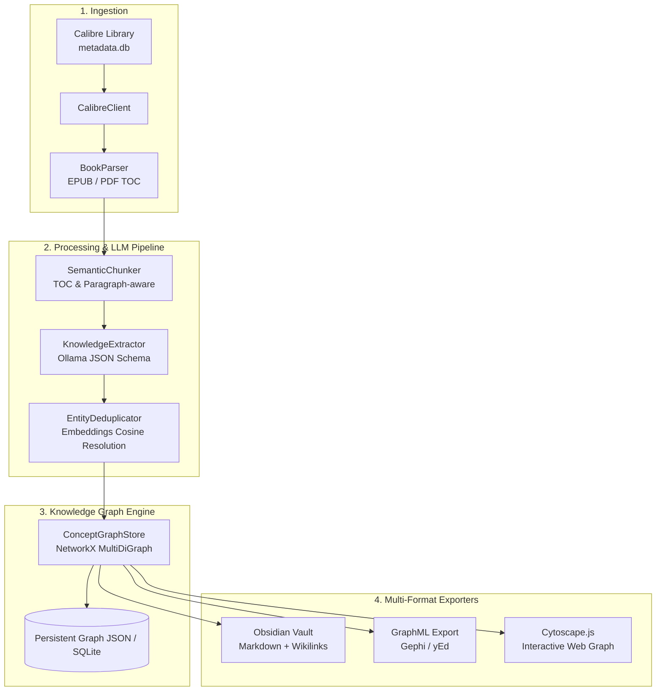

# 📚 bookeeper

> **Calibre library ingester, LLM metadata normalizer, and Concept Knowledge Graph extractor using local Ollama.**

`bookeeper` bridges your digital book library (EPUB / PDF via Calibre) with local Large Language Models (Ollama) to extract structured ideas, architectural patterns, technical themes, and concept graphs mapped down to individual chapters and sections.

---

## 🏗️ Architecture & Pipeline



---

## 📁 Repository Structure

```text
bookeeper/
├── .gitignore
├── README.md
├── pyproject.toml
├── config.yaml.example
├── src/
│   └── bookeeper/
│       ├── __init__.py
│       ├── cli.py               # Typer / Rich CLI interface
│       ├── config.py            # Pydantic v2 settings loading YAML / ENV
│       ├── calibre/             # Direct calibredb wrappers & parser
│       │   ├── __init__.py
│       │   ├── client.py        # Direct SQLite metadata.db reader & calibredb client
│       │   └── parser.py        # EPUB & PDF table-of-contents & text extractor
│       ├── processing/          # Chunking & extraction pipeline
│       │   ├── __init__.py
│       │   ├── chunker.py       # Semantic / TOC-based chunking
│       │   ├── extractor.py     # LangChain structured output schemas & Ollama chains
│       │   └── deduplicator.py  # Embedding-based entity resolution
│       ├── graph/               # Graph representation & exporters
│       │   ├── __init__.py
│       │   ├── store.py         # NetworkX MultiDiGraph storage & persistence
│       │   └── exporters.py     # Obsidian Markdown, GraphML, Cytoscape exporters
└── tests/
    ├── __init__.py
    └── test_chunker.py          # Unit tests for chunker & TOC parsing
```

---

## ⚡ Quick Start

### 1. Prerequisites

- **Python 3.10+** (Python 3.11, 3.12, 3.13 recommended)
- **Ollama** running locally:
  ```bash
  ollama run llama3:8b
  ollama pull nomic-embed-text
  ```
- **Calibre Library** (optional, you can also process standalone EPUB/PDF files).

### 2. Installation

Using `uv` (recommended):
```bash
cd ~/repos/bookeeper
uv venv
source .venv/bin/activate
uv pip install -e ".[dev]"
```

Or using standard `pip`:
```bash
cd ~/repos/bookeeper
python3 -m venv .venv
source .venv/bin/activate
pip install -e ".[dev]"
```

### 3. Configuration

Copy the example configuration file:
```bash
cp config.yaml.example config.yaml
```

Edit `config.yaml` to set your Calibre library path:
```yaml
calibre:
  library_path: "~/Calibre Library"

ollama:
  base_url: "http://localhost:11434"
  model: "llama3:8b"
  embedding_model: "nomic-embed-text"
```

---

## 💻 CLI Usage

```bash
# Check current configuration
bookeeper config

# List books in your Calibre library
bookeeper list-books --limit 25

# Search books by title or author
bookeeper list-books --search "Distributed Systems"

# Test TOC parsing and chunking on a book
bookeeper chunk "/path/to/book.epub"

# View Knowledge Graph statistics
bookeeper stats

# Export the Knowledge Graph to an Obsidian vault
bookeeper export --out ./my_obsidian_vault
```

---

## 🧠 Extracted Graph Models

### Concepts
- **Categories**: `Concept`, `Architectural Pattern`, `Theme`, `Methodology`, `Tradeoff`, `Technology`
- **Metadata**: Canonical title, definition description, recognized aliases, occurrence counter.

### Relationships
- `IMPLEMENTS` (e.g. *Event Sourcing* `IMPLEMENTS` *Append-only Storage*)
- `EXTENDS` (e.g. *CQRS* `EXTENDS` *CQS*)
- `CONTRASTS_WITH` (e.g. *Optimistic Locking* `CONTRASTS_WITH` *Pessimistic Locking*)
- `PART_OF` (e.g. *WAL* `PART_OF` *Database Engine*)
- `REQUIRES` (e.g. *Distributed Transactions* `REQUIRES` *Consensus Protocol*)
- `MITIGATES` (e.g. *Circuit Breaker* `MITIGATES` *Cascading Failure*)
- `INFLUENCES`

---

## 🧪 Running Tests

```bash
pytest
```
