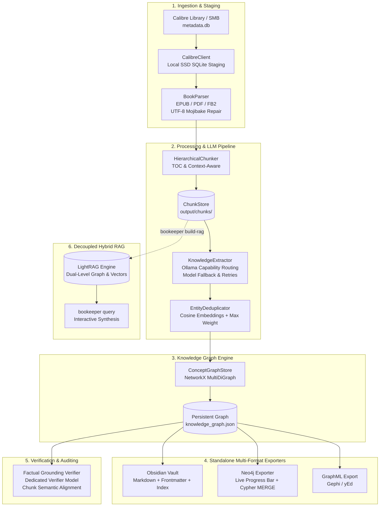

# 📚 bookeeper

> **Calibre library ingester, LLM metadata normalizer, and Concept Knowledge Graph extractor using local Ollama.**

`bookeeper` bridges your digital book library (EPUB / PDF / FB2 via Calibre) with local Large Language Models (Ollama) to extract structured ideas, architectural patterns, technical themes, and concept graphs mapped down to individual chapters and sections.

---

## 🏗️ Architecture & Pipeline



---

## 📁 Repository Structure

```text
bookeeper/
├── config.yaml               # User configuration (Ollama pool, Calibre, Neo4j, LightRAG, Verifier)
├── config.yaml.example       # Example configuration template with full options
├── pyproject.toml            # Project dependencies & CLI entrypoint
├── src/
│   └── bookeeper/
│       ├── cli.py            # Typer / Rich CLI commands with live progress indicators
│       ├── config.py         # Pydantic v2 settings loader with server capabilities & aliases
│       ├── calibre/          # SQLite reader & EPUB/PDF parser
│       │   ├── client.py     # Calibre library client & local DB SSD staging
│       │   └── parser.py     # TOC, chapter, and section parser with encoding repair
│       ├── processing/       # Chunking & Ollama pool extraction
│       │   ├── chunker.py    # Hierarchical chunking & ChunkStore
│       │   ├── extractor.py  # Structured concept schemas & Ollama invocation
│       │   ├── deduplicator.py # Vector deduplication & significance weight merging
│       │   ├── ollama_pool.py# Capability routing, failover & multi-server task distribution
│       │   ├── verifier.py   # Grounded concept verification & discrepancy auditing
│       │   └── state.py      # Resumable progress tracking & skipped book memorization
│       ├── graph/            # Knowledge graph storage & exporters
│       │   ├── store.py      # NetworkX MultiDiGraph persistence
│       │   ├── exporters.py  # Obsidian Markdown & GraphML exporters
│       │   └── neo4j_exporter.py # Real-time Rich progress bar & Cypher MERGE upsert
│       └── rag/              # Hybrid retrieval
│           └── lightrag_engine.py # LightRAG wrapper with failover pool
└── tests/                    # Pytest test suite (115+ unit & integration tests)
```

---

## ⚡ Quick Start

### 1. Prerequisites

- **Python 3.10+** (Python 3.12 recommended)
- **Ollama** running locally or across a network cluster:
  ```bash
  ollama pull qwen2.5:3b
  ollama pull llama3.1:8b
  ollama pull nomic-embed-text
  ```
- **Calibre Library** (local directory or mounted SMB network share).

### 2. Installation

Using `uv` (recommended):
```bash
cd ~/repos/bookeeper
uv venv
source .venv/bin/activate
uv pip install -e ".[dev]"
```

Or using standard `pip`:
```bash
cd ~/repos/bookeeper
python3 -m venv .venv
source .venv/bin/activate
pip install -e ".[dev]"
```

### 3. Configuration

```bash
cp config.yaml.example config.yaml
```

Edit `config.yaml` to point to your library and Ollama server(s):
```yaml
# Calibre Library Integration (Local folder or mounted SMB share)
calibre_library_path: "/Volumes/Calibre Library"
stage_metadata_db: true        # Stage SQLite DB on local SSD for microsecond queries
backup_metadata_db: true       # Create remote metadata.db.bak backup before syncing

# Primary Ollama LLM Configuration & Fallback Model
ollama_base_url: "http://192.168.50.15:11434"
llm_model: "qwen2.5:3b"
llm_model_fallback: "llama3.1:8b"   # Switched to after 50% chunk retries
request_timeout: 30                 # HTTP timeout in seconds per LLM call
max_retries: 1                     # Retries per attempt on an Ollama server
max_chunk_attempts: 6              # Maximum total retry attempts across pool for a stalled chunk

# Embeddings Configuration: Dedicated Endpoint or Cluster Pool
# Use "http://localhost:11434" for dedicated local Mac offloading, or "pool" to share cluster nodes
embedding_base_url: "http://localhost:11434"
embedding_model: "nomic-embed-text"

# Multi-Node Server Pool with Task Capabilities
ollama_servers:
  - url: "http://192.168.50.118:11434"
    priority: 1
    name: "mypc-gpu-node"
    capability: ["llm", "embedding", "verification"]
  - url: "http://192.168.50.15:11434"
    priority: 2
    name: "primary-gpu-node"
    capability: ["llm", "embedding"]
  - url: "http://localhost:11434"
    priority: 4
    name: "mac-node"
    capability: ["llm", "embedding"]
  - url: "http://192.168.50.20:11434"
    priority: 10
    name: "secondary-cpu-node"
    capability: ["embedding"]

# Separate Failover Cooldowns for Analysis and Verification
# Book analysis processes large batches of notes/chunks, supporting a longer timeout for nodes to recover.
analysis_cooldown_seconds: 600       # Timeout in seconds for extraction/analysis failovers (alias: failover_cooldown_seconds)
verification_cooldown_seconds: 60    # Timeout in seconds for verification retries (faster retry on small note batches)

# High-Performance Neo4j Graph Database Export
neo4j:
  enabled: true
  uri: "bolt://localhost:7687"
  user: "neo4j"
  password: "password"
  database: "neo4j"
  batch_size: 500
  clean_export: false

# LightRAG Retrieval Engine (Decoupled from ingestion)
enable_lightrag: false

# Factual Grounding Verification
verification:
  enabled: true
  model: "llama3.1:8b"
  percent: 1.0
  max_examples: 20
  cooldown_seconds: 60               # Dedicated verification failover cooldown (overrides verification_cooldown_seconds)
```

---

## 🌐 Multi-Node Ollama Cluster & Task Capabilities

`bookeeper` features an intelligent multi-server pooling engine designed for distributed heterogenous compute setups (e.g. powerful GPU rigs, Apple Silicon Mac nodes, and CPU servers):

- **Capability-Based Routing**: Each node advertises specific capabilities:
  - `llm`: Extraction of concepts, themes, and summaries.
  - `embedding`: Vector embeddings via `nomic-embed-text` for semantic chunking and entity deduplication.
  - `verification`: Factual grounding audits (`bookeeper verify`).
  - Tasks are dispatched strictly to alive nodes that support the required capability.
- **Priority Failover & Differentiated Cooldowns**:
  - Servers are ordered by priority (1 is highest). If a node fails, it enters a temporary cooldown, automatically diverting traffic to surviving nodes.
  - **Analysis Cooldown (`analysis_cooldown_seconds`, default: 600s / 10m)**: During heavy book ingestion and concept extraction, nodes process extensive batches of text. A higher cooldown prevents repeatedly hammering a stalled GPU server and grants time for VRAM recovery or reboot.
  - **Verification Cooldown (`verification_cooldown_seconds`, default: 60s / 1m)**: Verification audits evaluate small, focused batches of notes. Cooldowns are kept short so failover and retries occur swiftly without stalling the audit.
- **Dedicated Offloading vs. Cluster Pool for Embeddings**:
  - **Dedicated Offloading (`embedding_base_url: "http://localhost:11434"`)**: Offloading embeddings to a dedicated endpoint (such as a local Apple Silicon Mac) prevents remote GPU servers from unloading their LLM from VRAM to run embedding models, eliminating model-swapping latency.
  - **Cluster Pool Mode (`embedding_base_url: "pool"`)**: If you prefer distributing embeddings across your network cluster, set `embedding_base_url: pool` (or pass `--embedding-url pool`). Embeddings will be load-balanced across all nodes advertising the `embedding` capability in `ollama_servers`.
- **Parallel Task Pool & Real-Time Metrics**: Dynamically manages request pipelines, displays live terminal metrics (`active workers`, `avg latency`, `p80 latency`, `fastest node`), and logs per-node effort breakdowns (tasks, valuable characters, durations) at job completion.

---

## 🛡️ Robust Processing, Encoding & Fault Tolerance

- **Skip-on-First-Fail & Chunk Retrying**: When a chunk encounters an extraction error, the worker immediately defers that chunk and continues processing remaining chunks. Deferred chunks are retried at the end of the book run, ensuring pipeline throughput is not blocked.
- **Dynamic Model Fallback (`llm_model_fallback`)**: If a difficult chunk fails more than 50% of its retry attempts on the primary model (e.g., `qwen2.5:3b`), the pool automatically swaps the prompt to the configured fallback model (e.g., `llama3.1:8b`).
- **Full-Pipeline UTF-8 Mojibake Repair**: Cyrillic and complex multilingual character encodings (e.g., Windows-1251, ISO-8859-1, KOI8-R) are automatically repaired at every stage: Calibre metadata reading, book text parsing, prompt generation, chunk storage, knowledge graph serialization, and exports.
- **Skipped Book Memorization**: Non-text or graphical formats (`CBR`, `CBZ`, `DJVU`) and books missing files on disk are permanently memorized in `.bookeeper_state.json` with descriptive reasons. Subsequent runs skip them in microseconds without expensive file reads or network scans.
- **Local SQLite Staging & Safety**: When working over SMB or slow storage, `bookeeper` stages `metadata.db` to local SSD, executes transactions locally, creates an atomic `.bak` backup on the remote share, and syncs updates cleanly.

---

## 💻 CLI Commands Reference

### 🚀 Building the Knowledge Graph

```bash
# Continue indexing books from where you left off:
bookeeper build-graph

# Continue processing from the next unprocessed book (relative to existing knowledge_graph.json):
bookeeper build-graph --continue

# High-performance run (bypasses LightRAG during book ingestion for maximum speed):
bookeeper build-graph --no-lightrag

# Process all books in the Calibre library:
bookeeper build-graph --all

# Ingest a specific book by Calibre ID:
bookeeper build-graph --book-id 42

# Ingest a standalone EPUB or PDF file directly:
bookeeper build-graph --file "/path/to/book.epub"

# Retry previously failed books recorded in checkpoint state:
bookeeper build-graph --retry-failed

# Re-check and retry books previously recorded as skipped (e.g. format issues):
bookeeper build-graph --retry-skipped

# Specify custom primary and fallback LLM models:
bookeeper build-graph --model "qwen2.5:3b" --model-fallback "llama3.1:8b"

# Automatically export to Neo4j with clean start:
bookeeper build-graph --export-neo4j --clean-export

# Wipe checkpoint state, delete existing graph, and rebuild from scratch:
bookeeper build-graph --from-scratch

# Ingest up to N books and stop (e.g. process 5 books):
bookeeper build-graph --limit 5
```

---

### 🧪 Automated Test-Run Pipeline (`bookeeper test-run`)

Runs an end-to-end integration pipeline from scratch for a specified number of books, stopping immediately after successfully indexing `{book-cnt}` books, and then automatically launches verification:

```bash
# Ingest 5 books from scratch and automatically verify 1% of ideas:
bookeeper test-run 5

# Customize timeout, sample percentage, or verification mode:
bookeeper test-run 10 --timeout 60 --percent 2.0 --mode ideas

# Test run with a specific LLM model and custom Calibre path:
bookeeper test-run 3 --model "qwen2.5:3b" --calibre-path "/path/to/calibre"
```

**Pipeline Workflow:**
1. **Stage 1 (Build Graph)**: Executes `build-graph` with `--from-scratch`, `--no-lightrag`, `--clean-export`, and `--timeout 60` (or configured value), processing books until exactly `{book-cnt}` books are successfully integrated into the knowledge graph.
2. **Stage 2 (Verification)**: Automatically triggers `bookeeper verify` (default `--mode ideas`, `--percent 1.0%`) to validate factual grounding and report integrity statistics.

---

### 🔬 Automated A/B Testing & Branch Benchmarking (`scripts/ab_test.sh` / `scripts/ab_test.py`)

`bookeeper` provides an automated harness to benchmark and compare two Git branches or an existing baseline against a candidate branch across extraction speed, idea counts, and factual grounding:

```bash
# 1. Standard Branch vs Branch comparison (ingests 5 books per branch from scratch):
./scripts/ab_test.sh main feature-rolling-window 5

# 2. Compare against an existing baseline verification report (skips re-indexing Branch A):
./scripts/ab_test.sh vs ./ab_test_runs/run_20261010_120000/branch_A/verification_report.json feature-rolling-window 5

# 3. Direct Python invocation with custom arguments:
python3 scripts/ab_test.py main feature-rolling-window --books 5 --percent 2.0 --timeout 60
```

#### ⚙️ Configuration Customization Overlays (`config-a.yaml` & `config-b.yaml`)

When running A/B tests to evaluate architectural, chunking, or prompt changes, you can customize configurations per branch without modifying `config.yaml` or dirtying your Git working tree:

- **Base Configuration**: The runner reads `config.yaml` (or `--config <path>`).
- **Branch A Overlay**: If `config-a.yaml` (or `--config-a <path>`) exists, it is automatically deep-merged on top of `config.yaml` for Branch A.
- **Branch B Overlay**: If `config-b.yaml` (or `--config-b <path>`) exists, it is automatically deep-merged on top of `config.yaml` for Branch B.
- **Deep Merge Semantics**: Overlays recursively overwrite specific keys (e.g. `llm_model`, `chunk_size`, `verification_cooldown_seconds`, or nested blocks under `verification:`) while preserving all unmentioned base settings.
- **Reproducibility**: Merged configurations are written directly into the run session directory (`ab_test_runs/run_<timestamp>/branch_<X>/config.yaml`), ensuring clean git checkouts and deterministic reproducibility.

```bash
# Example with explicit overlay configs:
python3 scripts/ab_test.py main feature-rolling-window \
  --books 5 \
  --config config.yaml \
  --config-a config-a.yaml \
  --config-b config-b.yaml
```

---

### ⚡ Instant Knowledge Graph Rebuild (`bookeeper rebuild-graph`)

Reconstructs the entire Knowledge Graph from previously extracted per-book state checkpoints (`.book_states`) in seconds without running any LLM inference or re-chunking:

```bash
# Rebuild Knowledge Graph from all existing book states (swipes old graph first):
bookeeper rebuild-graph

# Rebuild and export directly to Neo4j:
bookeeper rebuild-graph --export-neo4j

# Rebuild only a specific book ID:
bookeeper rebuild-graph --book-id 42

# Rebuild up to 5 books from state files:
bookeeper rebuild-graph --limit 5
```

- **Clean Slate**: Automatically wipes existing `knowledge_graph.json`, `knowledge_graph.graphml`, Obsidian notes, and Neo4j database before rebuilding.
- **Zero Inferences**: Directly loads extracted concepts, quotes, and chunks from disk, reconstructing books, sections, chunks, grounding links, idea relations, and sequential links in seconds.
- **Preserves Skipped Books**: Re-initializes checkpoint completions while preserving memorized skipped formats.

### 📤 Standalone Exporters (No Book Re-processing)

Export your existing `knowledge_graph.json` directly to Obsidian, Neo4j, or GraphML without touching Calibre or Ollama:

```bash
# 1. Export current graph to ALL destinations (Obsidian, GraphML, and Neo4j):
bookeeper export

# Clean export (purges existing target vault and database before exporting):
bookeeper export --clean

# 2. Export ONLY to Obsidian Markdown vault:
bookeeper export-obsidian

# Clean export to custom Obsidian vault folder:
bookeeper export-obsidian --clean --vault-dir ~/Documents/ObsidianVault

# 3. Export ONLY to Neo4j (Cypher MERGE upsert with live progress bar):
bookeeper export-neo4j

# Clean start (purges existing Neo4j database with DETACH DELETE, then upserts):
bookeeper export-neo4j --clean
```

#### 📊 Live Neo4j Progress Bar
`export-neo4j` renders a real-time Rich progress display:
- **Clean Purge**: Displays detached node count when `--clean` is set.
- **Schema Stage**: Verifies uniqueness constraints and lookup indexes on node labels.
- **Nodes Stage**: Live progress bar showing active label (e.g. `Upserting Nodes (:Concept)`), item counts (`M of N`), elapsed time, and ETA.
- **Relationships Stage**: Live progress bar showing active relationship type (e.g. `Upserting Relationships (:DISCUSSES)`), item counts, and ETA.

---

### 🗑️ Removing Books from Knowledge Graph

Safely remove an unwanted book and all its associated artifacts:

```bash
# Remove book #42: purges Book node, sections, chunks, and orphan concepts:
bookeeper remove-book 42

# Remove and refresh custom Obsidian vault destination:
bookeeper remove-book 42 --export-obsidian ~/Documents/ObsidianVault
```
This command automatically updates `knowledge_graph.json`, clears the book's completed state from `.bookeeper_state.json` (allowing clean re-indexing), and refreshes Obsidian vault notes and GraphML exports.

---

### 🔬 Verification & Auditing (`bookeeper verify`)

`bookeeper verify` supports **three distinct verification modes**:

#### 1. Mode 1: Ideas Grounding Audit (`--mode ideas`, Default)
Audits whether extracted concepts and relationships in `knowledge_graph.json` are factually grounded in their assigned text chunks using a dedicated, powerful LLM verifier model (e.g. `gemma4:12b`, `qwen2.5:14b-instruct`, `llama3.1:8b`).

```bash
# Verify 1% of all ideas using configured verifier model (default mode):
bookeeper verify

# Custom sample percentage (e.g. 5%):
bookeeper verify --mode ideas --percent 5.0

# Use a dedicated, more capable verifier model:
bookeeper verify --mode ideas --model "gemma4:12b" --percent 2.0

# Limit discrepancy examples shown in terminal (default: up to 20):
bookeeper verify --max-examples 10

# Save full audit report to a custom JSON location:
bookeeper verify --output ./output/audit_report.json --seed 42
```

**What Ideas Mode Evaluates:**
- **Two-Line Live Status**: Real-time progress bar displaying current idea/book, ETA, task rate, and verified support percentage.
- **Statistical Summary**: Total ideas in graph, candidate ideas with chunks, sampled ideas, evaluated idea-chunk pairs, **Verified / Supported %**, and **Discrepancy / Unsupported %**.
- **Discrepancy Table**: Rich table of unsupported ideas displaying chunk location, quotes, and reasoning.
- **Server Effort Statistics**: Breakdown of tasks, throughput, durations, and valuable characters processed across each Ollama server.

---

#### 2. Mode 2: Semantic Chunking Coherence (`--mode chunking`)
Verifies semantic chunk coherence and boundary accuracy using incremental sentence expansion embeddings (smart chunking). Tests whether adding subsequent sentences into a chunk maintains cosine distance within accepted thresholds, shows distance distributions across chunks, and validates that stored chunks match smart semantic boundaries.

```bash
# Verify chunking coherence for a specific book by Calibre ID:
bookeeper verify --mode chunking --book-id 42

# Verify chunking coherence across all stored books:
bookeeper verify --mode chunking --all

# Custom cosine distance threshold for semantic expansion (default: 0.20):
bookeeper verify --mode chunking --book-id 42 --threshold 0.18

# Specify dedicated embedding model or endpoint:
bookeeper verify --mode chunking --book-id 42 --embedding-model "nomic-embed-text" --embedding-url "http://localhost:11434"
```

**What Chunking Mode Evaluates:**
- **Boundary Precision**: Confirms sentence-to-chunk cosine distances remain within the expected semantic threshold (`--threshold`, default: `0.20`).
- **Distance Distribution**: Visualizes mean, min, max, and outlier semantic drift distances across chapters and chunks.
- **Cache Consistency**: Verifies that serialized chunks in `output/chunks/` correspond directly to smart semantic boundaries.

---

#### 3. Mode 3: Dual Knowledge Base Cross-Check Audit (`--mode cross-check`)
Audits and compares factual retention across chunking strategies or branches (e.g., comparing candidate chunking algorithms or benchmarking two knowledge graphs) using **Natural Language Inference (NLI) Atomic Assertion Entailment**:

```bash
# Compare candidate knowledge graph or A/B test run against baseline:
bookeeper verify --mode cross-check --compare-graph ./ab_test_runs/run_20261010_120000/branch_B/knowledge_graph.json

# Audit 20 contiguous chunk blocks with a custom verifier model:
bookeeper verify --mode cross-check --compare-graph ./path/to/candidate_kg.json --blocks 20 --model "llama3.1:8b"

# Print side-by-side QA & Assertion probes for the first 3 audited blocks:
bookeeper verify --mode cross-check --compare-graph ./path/to/candidate_kg.json --print-blocks 3
```

**How NLI Cross-Check Verification Works:**
- **Exact Document Clamping**: Aligns contiguous chunk blocks between old and new systems using forward-anchored exact character spans within the raw book text, eliminating text span drift and boundary distortion.
- **Atomic Assertion Decomposition**: A high-capacity model analyzes the canonical raw passage and extracts 5 clear, factual, declarative statements (atomic claims) representing key events, entity actions, and conditions without relying on brittle surface quoting or trivia.
- **Entailment Classification**: Evaluates each atomic assertion against the extracted knowledge base ($E_{\text{old}}$ vs $E_{\text{new}}$), classifying each as `SUPPORTED`, `CONTRADICTED`, or `NOT_MENTIONED`.

**Metrics & Legend:**
- **Recall (NLI / QA Recall)**:
  Proportion of raw-passage factual assertions verified as `SUPPORTED` by the extracted knowledge base claims and entities.
  $$\text{Recall} = \frac{\sum \text{Supported Assertions}}{\text{Total Assertions}}$$
- **Seam Integrity (SIMINT / Seam Int)**:
  Measures retention of relational propositions spanning multiple sentences across chunk seams/boundaries. Detects seam severance where Sentence A (cause) and Sentence B (consequence) land on separate sides of a chunk boundary and the relationship is lost.
  $$\text{SIMINT} = \frac{\sum \text{Supported Cross-Boundary Assertions}}{\text{Total Cross-Boundary Assertions}}$$
- **Chunk Disproportion**:
  Normalized character overlap ratio between the candidate chunk span and canonical window:
  $$\text{Disproportion} = \frac{|A \cap B|}{|A \cup B|}$$

---

### 🧩 Decoupled LightRAG Indexing & Querying

```bash
# Build / update LightRAG database from locally cached SSD chunks:
bookeeper build-rag

# Recreate LightRAG database cleanly from scratch:
bookeeper build-rag --clean

# Index chunks for a specific book only:
bookeeper build-rag --book-id 42

# Hybrid graph + vector search (recommended):
bookeeper query "What are the core mechanisms of Paxos consensus?"

# Local entity-focused search:
bookeeper query "Who is Captain Rake?" --mode local

# Global thematic summary:
bookeeper query "What are the overarching themes of the series?" --mode global
```

---

### 🧹 Calibre Metadata Normalization

```bash
# Inspect Calibre metadata, repair mojibake, normalize titles & summaries via Ollama:
bookeeper clean-metadata --limit 50 --apply

# Dry run: preview metadata improvements without modifying Calibre:
bookeeper clean-metadata --limit 10 --dry-run
```

---

### 📊 Status & Metrics

```bash
# Display Knowledge Graph metrics (nodes, edges, node types, relationship types):
bookeeper stats

# Show processing checkpoint summary and skipped books count:
bookeeper status

# Inspect active configuration and server pool capabilities:
bookeeper config

# List or search books in the library:
bookeeper list-books --limit 20
bookeeper list-books --search "Redwall"
```

---

## 🧠 Concept Significance Weighting

Every extracted idea and concept is assigned a significance weight on a scale from **0 to 10**:

| Weight | Classification | Description & Examples |
| :---: | :--- | :--- |
| **0 – 2** | Generic / Primitive | Common notions, foundational terminology (*e.g.* `Identification`, `Measurement`, `User`). |
| **3 – 5** | Foundational Discipline | Standard principles and formal methodologies (*e.g.* `Risk Assessment`, `Database Normalization`). |
| **6 – 8** | Specific Architecture / Tech | Distinct technical patterns and concrete frameworks (*e.g.* `RAG`, `Event Sourcing`, `WAL`). |
| **9 – 10** | Specialized / Cutting-Edge | Original, deeply philosophical, or specialized concepts (*e.g.* `SmartRAG`, `Byzantine Fault Tolerant Raft`). |

- **Automatic Merging**: When concepts are deduplicated across chapters or books, the graph retains the maximum observed weight: `max(canonical.weight, incoming.weight)`.
- **Obsidian Frontmatter**: Notes include `weight: <W>` and the master index `00_Index.md` is sorted by weight descending.
- **Neo4j Property**: Stored directly on `:Concept` nodes as `n.weight` for easy Cypher filtering:
  ```cypher
  MATCH (c:Concept) WHERE c.weight >= 7 RETURN c.name, c.weight ORDER BY c.weight DESC
  ```

---

## 🧪 Running Tests

```bash
.venv/bin/pytest -v
```
