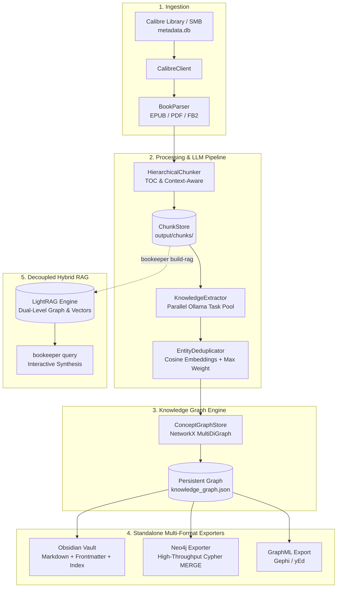

# 📚 bookeeper

> **Calibre library ingester, LLM metadata normalizer, and Concept Knowledge Graph extractor using local Ollama.**

`bookeeper` bridges your digital book library (EPUB / PDF via Calibre) with local Large Language Models (Ollama) to extract structured ideas, architectural patterns, technical themes, and concept graphs mapped down to individual chapters and sections.

---

## 🏗️ Architecture & Pipeline



---

## 📁 Repository Structure

```text
bookeeper/
├── config.yaml               # User configuration (Ollama pool, Calibre, Neo4j, LightRAG)
├── config.yaml.example       # Example configuration template
├── pyproject.toml            # Project dependencies & CLI entrypoint
├── src/
│   └── bookeeper/
│       ├── cli.py            # Typer / Rich CLI commands
│       ├── config.py         # Pydantic v2 settings loader
│       ├── calibre/          # SQLite reader & EPUB/PDF parser
│       │   ├── client.py     # Calibre library client & local DB staging
│       │   └── parser.py     # TOC, chapter, and section parser
│       ├── processing/       # Chunking & Ollama pool extraction
│       │   ├── chunker.py    # Hierarchical chunking & ChunkStore
│       │   ├── extractor.py  # Structured concept schemas & Ollama invocation
│       │   ├── deduplicator.py # Vector deduplication & significance weight merging
│       │   ├── ollama_pool.py# Failover & multi-server task distribution
│       │   └── state.py      # Resumable progress tracking
│       ├── graph/            # Knowledge graph storage & exporters
│       │   ├── store.py      # NetworkX MultiDiGraph persistence
│       │   ├── exporters.py  # Obsidian Markdown & GraphML exporters
│       │   └── neo4j_exporter.py # High-speed Neo4j Cypher MERGE upsert
│       └── rag/              # Hybrid retrieval
│           └── lightrag_engine.py # LightRAG wrapper with failover pool
└── tests/                    # Pytest test suite
```

---

## ⚡ Quick Start

### 1. Prerequisites

- **Python 3.10+** (Python 3.12 recommended)
- **Ollama** running locally or across a network cluster:
  ```bash
  ollama pull llama3.1:8b
  ollama pull nomic-embed-text
  ```
- **Calibre Library** (local folder or mounted SMB network share).

### 2. Installation

Using `uv` (recommended):
```bash
cd ~/repos/bookeeper
uv venv
source .venv/bin/activate
uv pip install -e ".[dev]"
```

Or using standard `pip`:
```bash
cd ~/repos/bookeeper
python3 -m venv .venv
source .venv/bin/activate
pip install -e ".[dev]"
```

### 3. Configuration

```bash
cp config.yaml.example config.yaml
```

Edit `config.yaml` to point to your library and Ollama server(s):
```yaml
calibre:
  library_path: "/Volumes/share/calibre" # Local path or SMB mount

ollama:
  base_url: "http://192.168.50.10:11434"
  model: "llama3.1:8b"
  embedding_model: "nomic-embed-text"
  servers: # Optional multi-node Ollama cluster
    - url: "http://192.168.50.10:11434"
      priority: 1
    - url: "http://192.168.50.11:11434"
      priority: 2

neo4j:
  enabled: true
  uri: "bolt://localhost:7687"
  user: "neo4j"
  password: "password"
  clean_export: false

lightrag:
  enabled: false # Set false for fast graph builds
```

---

## 💻 CLI Commands Reference

### 🚀 Building the Knowledge Graph

```bash
# Continue indexing books from where you left off (relative to knowledge_graph.json):
bookeeper build-graph

# High-performance run (bypasses heavy LightRAG LLM merging during ingestion):
bookeeper build-graph --no-lightrag

# Continue processing and perform clean start on export targets (Obsidian / Neo4j):
bookeeper build-graph --clean-export

# Ingest a specific book by Calibre ID:
bookeeper build-graph --book-id 42

# Ingest an explicit standalone EPUB/PDF file:
bookeeper build-graph --file "/path/to/book.epub"

# Process all books in the Calibre library:
bookeeper build-graph --all

# Retry previously failed books from checkpoint state:
bookeeper build-graph --retry-failed
```

---

### 📤 How to Export Only (Without Processing Books)

If you already have a `knowledge_graph.json` and want to export it to Obsidian, Neo4j, or GraphML **without connecting to Calibre or scanning/processing any books**, use the standalone export commands:

```bash
# 1. Export current graph to ALL destinations (Obsidian, GraphML, and Neo4j):
bookeeper export

# Clean export (wipes target vault and database before re-exporting current graph):
bookeeper export --clean

# 2. Export ONLY to Obsidian Markdown vault:
bookeeper export-obsidian

# Clean export to custom Obsidian vault folder:
bookeeper export-obsidian --clean --vault-dir ~/Documents/ObsidianVault

# 3. Export ONLY to Neo4j (Cypher MERGE upsert):
bookeeper export-neo4j

# Clean start (purges existing Neo4j database with DETACH DELETE, then inserts):
bookeeper export-neo4j --clean
```

---

### 🧩 Decoupled LightRAG Indexing

LightRAG performs deep dual-level relation extraction and vector embedding. Decoupling it from book ingestion dramatically speeds up both pipelines:

```bash
# Phase 1: Ingest books and build graph at full speed (no LightRAG bottleneck):
bookeeper build-graph --no-lightrag

# Phase 2: Build / update LightRAG database from locally cached SSD chunks:
bookeeper build-rag

# Recreate LightRAG database cleanly from scratch:
bookeeper build-rag --clean

# Index chunks for a specific book only:
bookeeper build-rag --book-id 4
```

---

### 🔍 Querying the Library (LightRAG)

```bash
# Hybrid graph + vector search (recommended):
bookeeper query "What are the core mechanisms of Paxos consensus?"

# Local entity-focused search:
bookeeper query "Who is Captain Rake?" --mode local

# Global thematic summary:
bookeeper query "What are the overarching themes of the series?" --mode global
```

---

### 🔬 Factual Verification & Discrepancy Audit

Verify that extracted concepts and ideas in `knowledge_graph.json` are factually grounded and genuinely present in their assigned text chunks using a dedicated verifier model:

```bash
# Verify 1% of all ideas using configured dedicated verifier model:
bookeeper verify

# Custom sample percentage (e.g. 5% or 10%):
bookeeper verify --percent 5.0

# Use a dedicated, more powerful verifier model:
bookeeper verify --model "qwen2.5:14b-instruct" --percent 2.0

# Limit discrepancy examples shown in terminal (default: up to 20):
bookeeper verify --max-examples 10

# Save full audit report to a custom JSON location:
bookeeper verify --output ./output/audit_report.json --seed 42
```

**Verification Output Includes:**
- **Statistical Summary**: Total ideas in graph, candidate ideas with chunks, sampled ideas, total idea-chunk pairs evaluated, **Verified / Supported %** (Good), and **Discrepancy / Unsupported %** (Failed).
- **Discrepancy Report Table**: Up to 20 examples of unsupported/hallucinated ideas with chunk location, quote, and detailed explanation of why the text fails to support the idea.
- **Persistent JSON Report**: Saves the full breakdown (`stats`, `discrepancies`, and `verified_samples`).

---

### 🧹 Calibre Metadata Normalization

```bash
# Inspect Calibre metadata, repair mojibake, normalize titles & summaries via Ollama:
bookeeper clean-metadata --limit 50 --apply

# Dry run: preview metadata improvements without modifying Calibre:
bookeeper clean-metadata --limit 10 --dry-run
```

---

### 📊 Status & Metrics

```bash
# Display Knowledge Graph metrics (nodes, edges, node types, relationship types):
bookeeper stats

# Show processing checkpoint summary:
bookeeper status

# Inspect active configuration and server pool:
bookeeper config

# List or search books in the library:
bookeeper list-books --limit 20
bookeeper list-books --search "Redwall"
```

---

## 🧠 Concept Significance Weighting

Every extracted idea and concept is assigned a significance weight on a scale from **0 to 10**:

| Weight | Classification | Description & Examples |
| :---: | :--- | :--- |
| **0 – 2** | Generic / Primitive | Common notions, foundational terminology (*e.g.* `Identification`, `Measurement`, `User`). |
| **3 – 5** | Foundational Discipline | Standard principles and formal methodologies (*e.g.* `Risk Assessment`, `Database Normalization`). |
| **6 – 8** | Specific Architecture / Tech | Distinct technical patterns and concrete frameworks (*e.g.* `RAG`, `Event Sourcing`, `WAL`). |
| **9 – 10** | Specialized / Cutting-Edge | Original, deeply philosophical, or specialized concepts (*e.g.* `SmartRAG`, `Byzantine Fault Tolerant Raft`). |

- **Automatic Merging**: When concepts are deduplicated across chapters or books, the graph retains the maximum observed weight: `max(canonical.weight, incoming.weight)`.
- **Obsidian Frontmatter**: Notes include `weight: <W>` and the master index [`00_Index.md`](file:///Users/serg/repos/bookeeper/output/obsidian_vault/00_Index.md) is sorted by weight descending.
- **Neo4j Property**: Stored directly on `:Concept` nodes as `n.weight` for easy Cypher filtering:
  ```cypher
  MATCH (c:Concept) WHERE c.weight >= 7 RETURN c.name, c.weight ORDER BY c.weight DESC
  ```

---

## 🧪 Running Tests

```bash
.venv/bin/pytest -v
```
